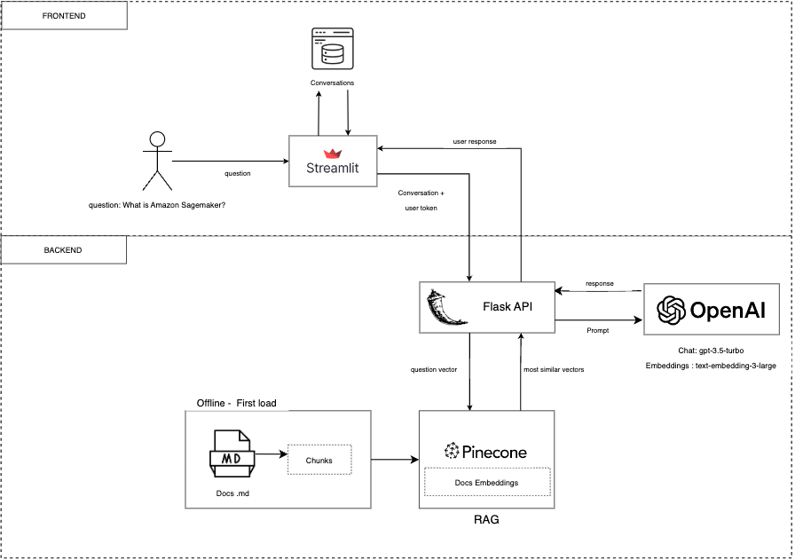

# Documents Chat App 


## Description
Documents Chat App is an application that allows you to ask questions related to AWS Documentation (or whatever markdown files).

## Pre-requisites
To use this app, you should have access to the following resources:
- OpenAI API Key
- Pinecone API Key
- Python >= 3.9

## System Architecture


The architecture was built with a focus on local deployment. This application utilizes Flask API as the backend and Streamlit as the frontend. The user's question follows this process:
1. The user poses a question using the Streamlit app.
2. The question, along with the last messages in the conversation, is sent to the Flask API. If it's a new conversation, only the current message is sent.
3. The question is converted to a vector using the OpenAI embedding model. This vector is then sent to Pinecone to search for vector similarity with pre-loaded document embeddings.
4. The retriever identifies the most similar vector and inserts it into the LLM prompt as context.
5. The LLM receives the prompt along with the context of the .md documentation and generates a response.
5. The LLM's response is displayed in the Streamlit app.
7. The conversation session is saved into a .db file."

## Installation

1. Clone the superfolder repository:
    ```bash
    git clone https://github.com/omarftt/ChallengeChat.git
    cd ChallengeChat
    ```

2. Set up the backend :
    ```bash
    cd backend_folder
    # Follow backend installation instructions
    ```

3. Set up the frontend:
    ```bash
    cd frontend_folder
    # Follow frontend installation instructions
    ```

4. Configure communication between frontend and backend (if needed).

## Usage
This application employs a token for sending requests between Streamlit and the API. Please configure its value before running the application locally. For testing purposes, use any token of your choice. To configure the **TOKEN_API**, insert the same value in both the frontend and backend as follows:

1. Insert TOKEN_API in frontend:
    ```bash
    # In the config.py file, modify python class Config with TOKEN API value
    TOKEN_API = "##INSERT VALUE HERE##"
    ```
2. Insert TOKEN_API in backend:
    ```bash
    # Create a .env file and insert TOKEN API value
    TOKEN_API = "##INSERT VALUE HERE##"
    ```


## Comming Soon (Deployment) ... 
To deploy this application, the follow architecture is proposed:
[GCP Architecture](https://res.cloudinary.com/unicloud010/image/upload/v1707173041/GCP_apdqhg.png)


